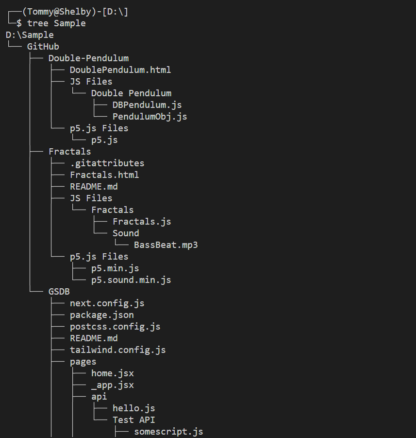

# FAT32 and NTFS explorer
HCMUS - 21CLC05 - Operating System project

GV: **Lê Viết Long**
## Thành Viên
- 21127243 - Phùng Siêu Đạt - **Nhóm trưởng**

- 21127296 - Đặng Hà Huy

- 21127300 - Nguyễn Cát Huy
## Mô tả
Shelby là một ứng dụng được viết bằng Python mô phỏng một shell giống trên linux, hay còn gọi là pseudo-shell để truy cập vào hệ thống tập tin FAT32 và NTFS và thực hiện các chức năng cơ bản sau: 
* **ls**: Liệt kê các files
* **cd**: Chuyển đổi thư mục
* **cat**: In nội dung file
* **tree**: Vẽ cây thư mục
* **fsstat**: Hiển thị thông tin về hệ thống thư mục
* **xxd**: In ra hexdump của 1 file
## Cách sử dụng
```python
python main.py
```
## Demo
### Intro
**FAT32**

**NTFS**


### Một số chức năng cơ bản
*Tương thích với cả FAT32 và NTFS*


### tree


### xxd

## Deadline
3 tuần
